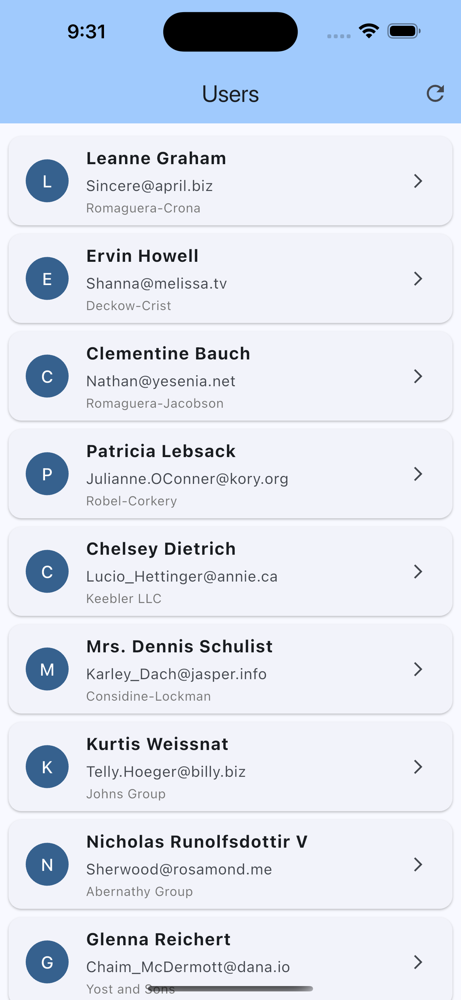
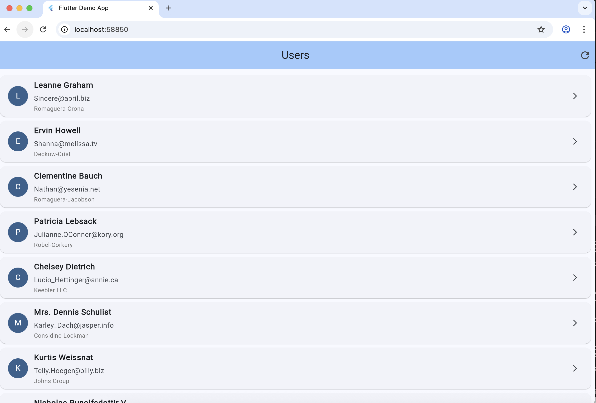

# Flutter Demo App

Simple app for QA testing that shows a list of users and their details.

---

## What It Does

Pulls user data from JSONPlaceholder API and displays it in a clean interface. Built with minimal dependencies following our standard architecture.

---

## Screenshots

### Mobile (iOS)

### Web

---

## Architecture

Uses clean architecture with separation of concerns:

- **models/** - Data models with JSON serialization (generated files in ~gen/)
- **services/** - API calls and dependency injection
- **ui/** - All screens and widgets

---

## Install Flutter

**Mac:**
flutter install via homebrew then run flutter doctor

**Windows/Linux:**

Get it from flutter.dev

---

## Setup

First time running:

bash:
cd flutter_demo_app
flutter pub get
dart run build_runner build --delete-conflicting-outputs

---

## Run It

**Web:**
bash:
flutter run -d chrome

**iOS:**
bash:
flutter run -d ios

**Android:**
bash:
flutter run -d android

---

## For QA Testing

The app loads 10 users on launch. Tap any user to see their full details. Pull down to refresh or use the refresh button in the top right.

### Test Keys for Appium

- `user_list`
- `user_card_1`, `user_card_2`, etc
- `user_name_1`, `user_email_1`, etc
- `refresh_button`
- `loading_indicator`
- `error_message`
- `user_detail_content`
- `name_value`, `email_value`, `phone_value`

### Test Flow

Basic test flow: launch app, wait for list to load, tap a user, verify details show, go back. Also test the refresh functionality and error handling by turning on airplane mode.

Use the key values instead of xpath. Make sure your Appium driver is configured correctly.

**API:** jsonplaceholder.typicode.com - free testing API that always returns the same 10 users.

---

## Project Structure

lib/
  models/
    ~gen/user.g.dart
    user.dart
  services/
    api_service.dart
    service_locator.dart
  ui/
    screens/
      home_screen.dart
      user_detail_screen.dart
    widgets/
      user_card.dart
  main.dart

---

## Dependencies

Only three packages:

- **dio** - HTTP requests
- **get_it** - Dependency injection
- **json_annotation** - JSON serialization

---

## Regenerating Code

If you modify the User model, run:

bash:
dart run build_runner build --delete-conflicting-outputs

This regenerates the files in the ~gen folder.